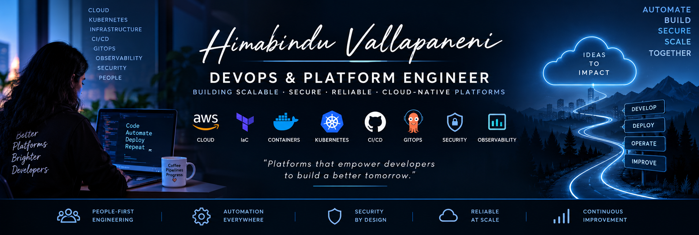

<div align="center">



[](https://www.linkedin.com/in/himabindu-v-12ba84282)
[](https://github.com/HimabinduVallapaneni?tab=repositories)
[](https://github.com/HimabinduVallapaneni)

### ⚙️ DevOps_Platform Engineering  •  ☁️ Cloud Infrastructure  •  ☸️ Kubernetes  •  🚀 Automation

</div>

---

## 👩‍💻 About Me

I am a **DevOps_Platform Engineer with 5+ years of experience working across cloud infrastructure, CI/CD automation, Infrastructure as Code, containers, Kubernetes, security, and production operations.

--> My focus is building **reusable, automated platforms and delivery workflows** that reduce manual engineering effort and provide development teams with consistent ways to build, test, secure, deploy, and operate applications.

--> I work across the platform lifecycle—from infrastructure provisioning and containerization to CI/CD, Kubernetes, GitOps, observability, security controls, and production reliability.

> ### 💡 Engineering Principle
>
> **Good platforms remove repetitive infrastructure work from developers and provide secure, reliable paths to production.**
### Skill Set
<div align="center">

|       ☁️ CLOUD & IaC       |   ☸️ CONTAINERS & K8S  |   🚀 DELIVERY PLATFORM   | 📊 RELIABILITY & SECURITY |
| :------------------------: | :--------------------: | :----------------------: | :-----------------------: |
|      AWS · Azure           |   Docker · Kubernetes  | GitHub Actions · Jenkins |   Monitoring · Alerting   |
| Terraform · CloudFormation |     Helm · AWS EKS     |     · Git                |    Health Checks · RCA    |
|   VPC · IAM · Networking   |    ·Services · RBAC    |     GitOps · Argo CD     |     SAST · SCA · Trivy    |
| ·Python (Automation)       |·Workload Configuration |    Reusable Workflows    |  Policy · Security Gates  |

</div>

---
### Projects

## 🚀 Featured Project #1

### ☸️ DevOps — CI/CD, Containers, Kubernetes & GitOps

**[DevSecOps CI/CD Pipeline for a TypeScript Application](https://github.com/HimabinduVallapaneni/Typescript_CICD)**

A hands-on **DevOps and Platform Engineering project** demonstrating an automated path from source code to containerized Kubernetes workloads.

The project combines application validation, CI/CD automation, container engineering, security scanning, immutable artifact management, Kubernetes configuration, and GitOps-oriented delivery.

### Platform Capabilities

✅ GitHub Actions CI/CD automation | ✅ Automated testing and code-quality validation | ✅ Reproducible Node.js builds with `npm ci` | ✅ Multi-stage Docker builds | ✅ Container vulnerability scanning with Trivy | ✅ Security gates for critical/high vulnerabilities | ✅ Container publishing to GitHub Container Registry | ✅ Immutable image tagging using Git commit SHA | ✅ Automated Kubernetes manifest updates | ✅ Git-managed deployment configuration


### Delivery Architecture

```text
Developer
    │
    ▼
Git Push / Pull Request
    │
    ▼
┌─────────────────────┐   ┌─────────────────────┐   ┌─────────────────────┐   ┌─────────────────────┐  ┌─────────────────────┐
│      CI Pipeline    │   │   Container Build   │   │   Security Gate     │   │        GHCR         │  │ Kubernetes Manifest │
│ Test • Lint • Build │   │  Multi-stage Docker │   │       Trivy         │   │ Immutable SHA Image │  │   Image Tag Update  │
└─────────────────────┘   └─────────────────────┘   └─────────────────────┘   └─────────────────────┘  └──────────┬──────────┘
                                                                                                                  ▼
                                                                                                                Argo CD  
                                                                                                                  │
                                                                                                                  ▼
                                                                                                              Kubernetes                                                       
```

**Automation · Containers · Kubernetes · GitOps · Security**

[](https://github.com/HimabinduVallapaneni/Typescript_CICD)
[](https://github.com/HimabinduVallapaneni/Typescript_CICD/blob/main/.github/workflows/ci-cd.yml)

---

## ☁️ Featured Project #2

### AWS Infrastructure Platform with CloudFormation

**[AWS Infrastructure Architecture with CloudFormation](https://github.com/HimabinduVallapaneni/AWS_Architectures_CloudFormation)**

A hands-on **Infrastructure-as-Code project** demonstrating automated provisioning of AWS networking, compute, security, and scaling infrastructure using CloudFormation.

### Infrastructure Engineering

* ✅ CloudFormation YAML templates
* ✅ Parameterized infrastructure configuration
* ✅ Dynamic AMI retrieval through AWS Systems Manager
* ✅ Reusable infrastructure definitions
* ✅ Automated resource tagging
* ✅ Resource dependency management


### Infrastructure Flow

**Infrastructure as Code · Networking · Compute · Security · Scaling**

[](https://github.com/HimabinduVallapaneni/AWS_Architectures_CloudFormation)

---

## 🔐 Featured Project #3

### SecureHub — Secure Software Delivery Platform

**[SecureHub](https://github.com/HimabinduVallapaneni/SecureHub)**

SecureHub demonstrates how **platform engineering and DevSecOps controls can provide developers with a standardized secure delivery workflow**.

Rather than treating security as a separate final stage, the project integrates security checks directly into repository and CI/CD workflows.

### Platform & Application Architecture

* ✅ FastAPI backend
* ✅ REST API architecture
* ✅ Frontend/backend separation
* ✅ Git-based development workflow
* ✅ Feature and DevOps branch workflows
* ✅ Pull-request integration

### Platform Security Controls

### Secure Developer Workflow

```text
Developer --> Git/Pull Request --> Secret SCanning --> SAST+SCA -->CI/CD Security Gates --> Container Security --> Infra Validation --> Secure Deployment
```

The goal is to create a **repeatable paved road** where developers receive automated security feedback as part of their normal delivery workflow.

[](https://github.com/HimabinduVallapaneni/SecureHub)
[](https://github.com/HimabinduVallapaneni/SecureHub/tree/devops)

---

## 🧰 Platform Engineering Toolkit

```text
Cloud          AWS • Azure • Working knowledge of GCP
IaC            Terraform • CloudFormation
Containers     Docker • Kubernetes • Helm • AWS EKS • AKS
CI/CD          GitHub Actions • Jenkins 
GitOps         Git • Argo CD
Automation     Python • Bash • PowerShell • Python (Boto3) • AWS SDK
Security       Trivy • Gitleaks • SAST • SCA • IaC Scanning
Observability  Monitoring • Alerting • Logging • RCA • (Prometheus • Grafana Dashboards) • Linux troubleshooting
```

---

<div align="center">

### Building automated platforms that make software delivery easier, safer, and more reliable.


</div>

<div align="center">


[](https://www.linkedin.com/in/himabindu-v-12ba84282)
[](https://github.com/HimabinduVallapaneni?tab=repositories)
[](https://github.com/HimabinduVallapaneni)

</div>
